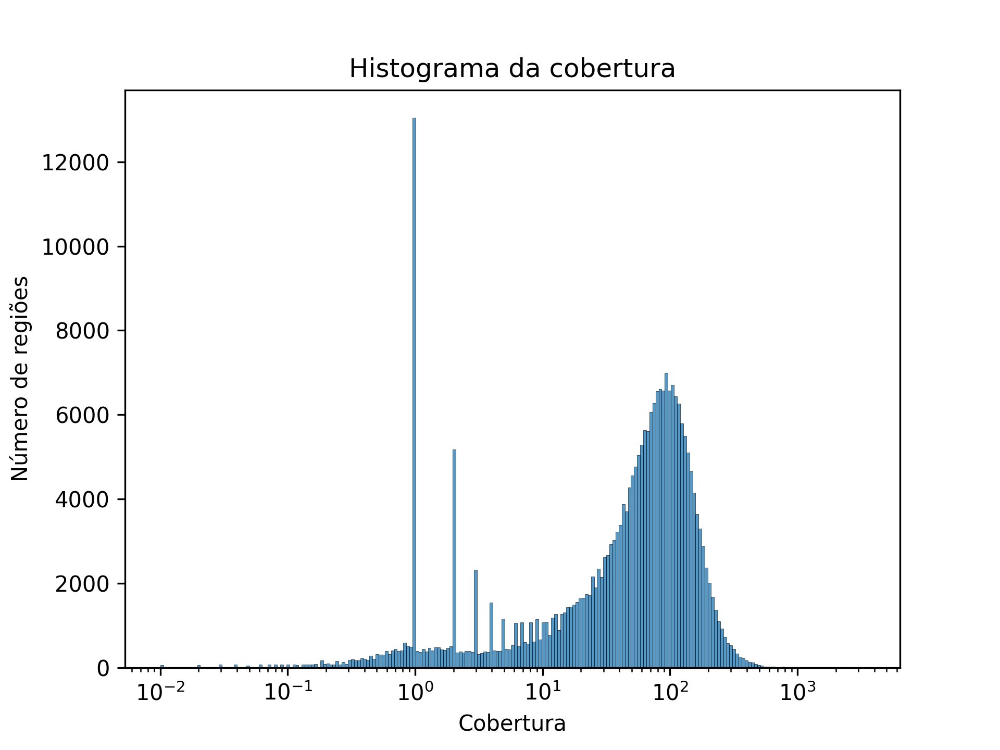
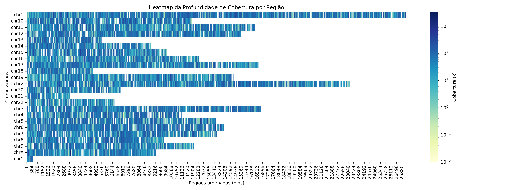

## 📌 Interpretação das Métricas
- A **profundidade média** representa a média de vezes que cada base foi sequenciada.
  - ✅ Valores acima de 30x são geralmente considerados confiáveis para análise.
- A **porcentagem de cobertura ≥10x e ≥30x** indica o quanto do exoma alvo foi suficientemente sequenciado:
  - 🧪 ≥10x: adequado para detecção de variantes comuns.
  - 🧬 ≥30x: adequado para detecção precisa de variantes raras.

# ✅ **Resumo dos Resultados de Cobertura**

- 🔬 **Profundidade média:** **64.17x**
- 🧪 **Cobertura ≥10x:** **82.76%** (boa para variantes comuns)
- 🧬 **Cobertura ≥30x:** **72.23%** (essencial para variantes raras)

> ⚠️ Regiões com cobertura abaixo de 10x podem comprometer a detecção de variantes.
> ✅ A maioria das regiões com ≥30x indica uma boa confiabilidade dos dados.

## 📊 Visualização dos Resultados

---

### 📉 Histograma da Cobertura (escala logarítmica)
Este gráfico mostra a distribuição da profundidade de cobertura por região. A escala logarítmica permite visualizar melhor as regiões com baixa e alta cobertura.

**Entendendo a escala logarítmica (base 10):**
- 10^0 = 1x
- 10^1 = 10x
- 10^1.5 ≈ 32x
- 10^2 = 100x

🧠 Para interpretar:
- 🔸 10x → log10(10) = 1
- 🔸 30x → log10(30) ≈ 1.48
- Se muitas regiões estão à esquerda de 1 → baixa cobertura.
- Se o pico está à direita de 1.5 → cobertura adequada.

# 🔥 Heatmap de Cobertura
O heatmap exibe a cobertura ao longo dos cromossomos. Cada linha representa um cromossomo e cada coluna representa uma região ordenada.
🟦 **Regiões mais escuras representam melhor cobertura**, enquanto 🟥 **regiões mais claras indicam baixa cobertura ou ausência de dados.** Isso ajuda a identificar áreas mal sequenciadas que podem comprometer a análise.

